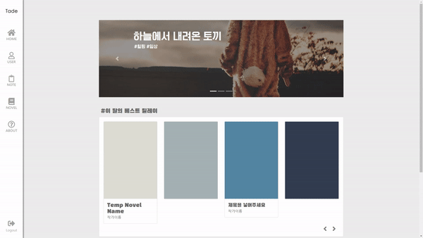
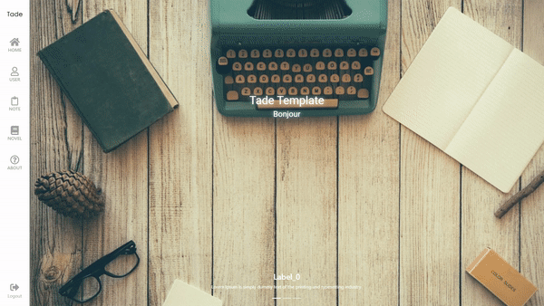
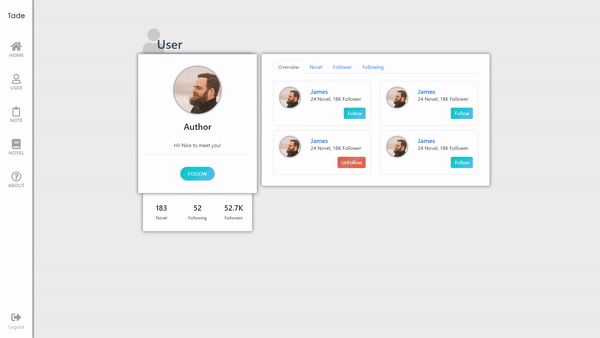
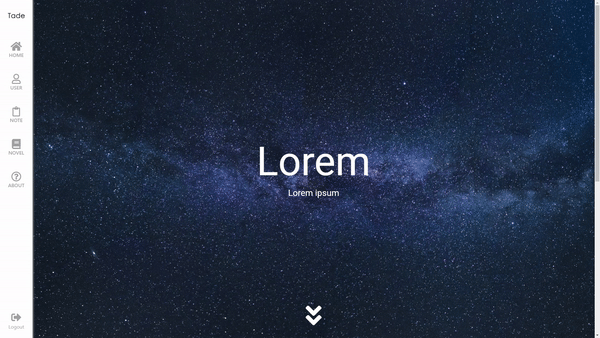
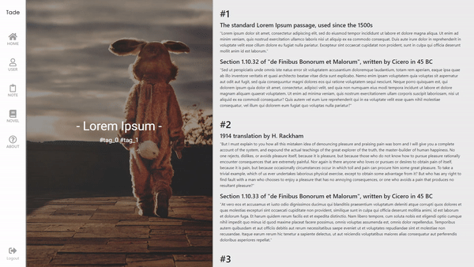
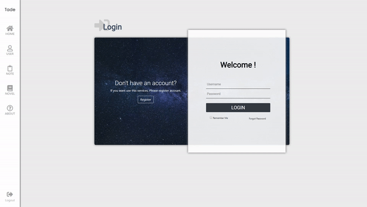
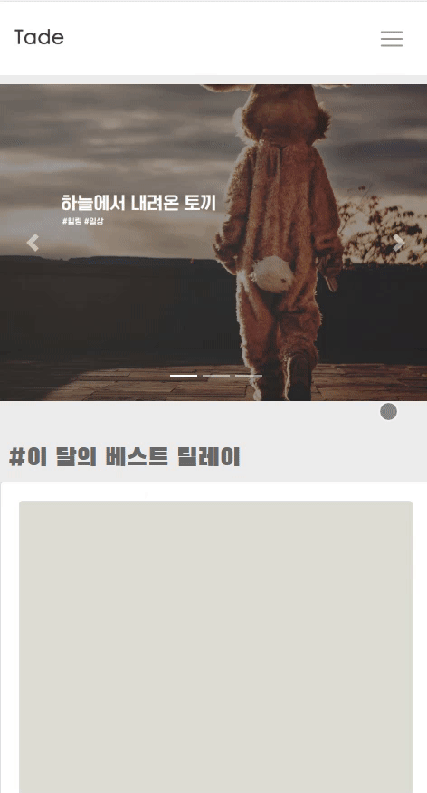
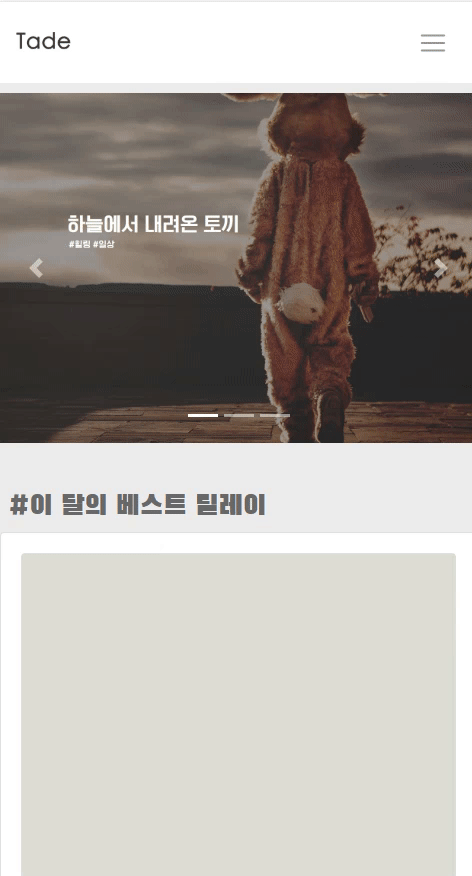

    

    <strong>웹 애플리케이션 템플릿 프로젝트</strong>

## Intro
반응형 웹 사이트 프로젝트로 [다음](https://github.com/kyechan99/Tade/blob/master/package.json#L19)과 같은 테크들을 사용했습니다.

어떠한 용도로 사용하셔도 괜찮으며 책임을 지지 않습니다.

다양한 피드백 및 조언 모두 환영합니다.

## Dev (개발 메모)
#### 모듈 다운 

`npm install`

#### 실행 

`node app.js`

#### views
 `views/layouts` : 레이아웃 (반복 코드 미리 구성)
 
 `views/components` : 부품 (header, footer 등등)
 
 `views/business` : 실제 로직 

## 프로젝트
[EON](https://github.com/kyechan99/EON-WebServer) 프로젝트의 프론트엔드 진행중 괜찮은 아이디어가 떠올라 분리개발하기로 결정.

## Preview
#### Index

#### Home

#### User

#### Note

#### Novel

#### Login

#### Responsive

